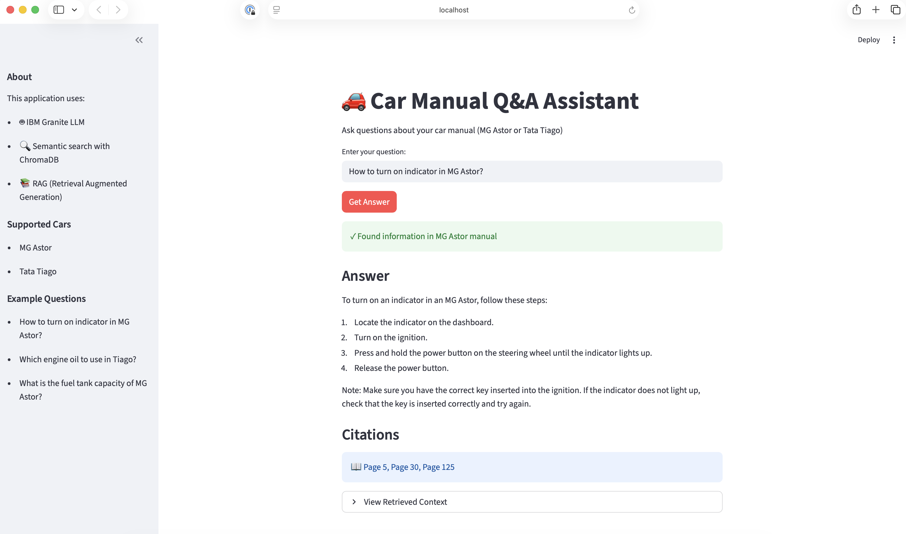

# Car Manual Q&A Application

A simple web application that allows users to ask questions about car manuals using RAG (Retrieval Augmented Generation) with IBM Granite LLM.



## Features

- 🚗 Support for multiple car manuals (MG Astor, Tata Tiago)
- 🤖 Powered by IBM Granite 3B model via LangChain
- 🔍 Semantic search using ChromaDB and sentence-transformers
- 📖 Provides answers with page citations
- 📝 Comprehensive logging for debugging and monitoring
- 💯 100% Open Source

## Architecture

- **Frontend**: Streamlit
- **LLM**: IBM Granite (via Hugging Face + LangChain)
- **Vector Database**: ChromaDB
- **Embeddings**: sentence-transformers (all-MiniLM-L6-v2)
- **PDF Processing**: pdfplumber

## Prerequisites

- Python 3.8 or higher
- 8GB+ RAM recommended (for running the LLM)
- Internet connection (for initial setup)

## Installation

1. **Clone or extract the project**

2. **Create a virtual environment** (recommended)
```bash
python -m venv venv
source venv/bin/activate  # On Windows: venv\Scripts\activate
```

3. **Install dependencies**
```bash
pip install -r requirements.txt
```

## Setup

### Step 1: Download Manuals and Setup Database

Run the setup script to download car manuals and create the vector database:

```bash
python setup_data.py
```

This will:
- Download MG Astor and Tata Tiago manuals
- Extract text from PDFs
- Create embeddings and store in ChromaDB
- Takes 5-10 minutes depending on your internet speed

### Step 2: Run the Application

```bash
streamlit run app.py
```

The application will open in your browser at `http://localhost:8501`

**Note**: The first run will download the IBM Granite model (~2GB), which may take some time.

## Usage

1. Enter your question in the text input field
2. Make sure to mention the car model (e.g., "MG Astor" or "Tata Tiago")
3. Click "Get Answer"
4. View the answer with page citations

### Example Questions

- "How to turn on indicator in MG Astor?"
- "Which engine oil to use in Tiago?"
- "What is the fuel tank capacity of MG Astor?"
- "How to adjust the seat in Tata Tiago?"

### Console Output Example

When you run the application, you'll see detailed logs showing the entire processing pipeline:

```
🚗 Car Manual Q&A Application
==============================

Starting Streamlit application...

  Local URL: http://localhost:8501

2026-01-18 19:43:39 - INFO - Initializing application components...
2026-01-18 19:43:39 - INFO - Loading vector store...
2026-01-18 19:43:39 - INFO - 🗄️  Initializing Vector Store...
2026-01-18 19:43:39 - INFO -    Database path: ./chroma_db
2026-01-18 19:43:39 - INFO -    Collection name: car_manuals
2026-01-18 19:43:43 - INFO -    ✓ Collection ready (documents: 979)
2026-01-18 19:43:43 - INFO - ✓ Vector Store initialized successfully!
2026-01-18 19:43:43 - INFO - Loading RAG pipeline with IBM Granite model...
2026-01-18 19:43:43 - INFO - 🤖 Initializing IBM Granite model...
2026-01-18 19:43:43 - INFO -    Model: ibm-granite/granite-3b-code-instruct
2026-01-18 19:43:43 - INFO -    Device: CPU
2026-01-18 19:43:44 - INFO -    Loading tokenizer...
2026-01-18 19:43:44 - INFO -    ✓ Tokenizer loaded
2026-01-18 19:43:44 - INFO -    Loading model (this may take a few minutes)...
Loading checkpoint shards: 100%|██████████████████| 2/2 [00:05<00:00,  2.68s/it]
2026-01-18 19:43:51 - INFO -    ✓ Model loaded
2026-01-18 19:43:57 - INFO - ✓ IBM Granite RAG pipeline initialized successfully!
2026-01-18 19:43:57 - INFO - ✓ All components initialized successfully

# When user asks a question:
2026-01-18 19:44:12 - INFO - ================================================================================
2026-01-18 19:44:12 - INFO - 📝 Question received: How to turn on indicator in MG Astor?
2026-01-18 19:44:12 - INFO - ⏰ Timestamp: 2026-01-18 19:44:12
2026-01-18 19:44:12 - INFO - 🔍 Step 1: Detecting car model...
2026-01-18 19:44:12 - INFO - ✓ Detected car model: MG Astor (matched keyword: 'mg astor')
2026-01-18 19:44:12 - INFO - 🔍 Step 2: Searching vector database for 'MG Astor'...
2026-01-18 19:44:12 - INFO -    Retrieving top 3 relevant chunks...
2026-01-18 19:44:12 - INFO -    Generating query embedding...
Batches: 100%|████████████████████████████████████| 1/1 [00:00<00:00,  4.21it/s]
2026-01-18 19:44:12 - INFO -    Querying ChromaDB...
2026-01-18 19:44:12 - INFO -    Found 3 results
2026-01-18 19:44:12 - INFO - ✓ Search complete, returning 3 results
2026-01-18 19:44:12 - INFO - ✓ Retrieved 3 relevant chunks
2026-01-18 19:44:12 - INFO -    Chunk 1: Page 125, Distance: 0.4597
2026-01-18 19:44:12 - INFO -    Chunk 2: Page 5, Distance: 0.5024
2026-01-18 19:44:12 - INFO -    Chunk 3: Page 30, Distance: 0.5065
2026-01-18 19:44:12 - INFO - 🤖 Step 3: Generating answer using IBM Granite LLM...
2026-01-18 19:44:12 - INFO - Preparing context from 3 documents...
2026-01-18 19:44:12 - INFO -    Context length: 1745 characters
2026-01-18 19:44:12 - INFO -    Pages referenced: [125, 5, 30]
2026-01-18 19:44:12 - INFO - Invoking LLM to generate answer...
2026-01-18 19:44:12 - INFO -    Prompt length: 2014 characters
2026-01-18 19:45:28 - INFO -    Raw answer length: 2421 characters
2026-01-18 19:45:28 - INFO - ✓ Answer generated (406 characters)
2026-01-18 19:45:28 - INFO - ✓ Answer generated successfully
2026-01-18 19:45:28 - INFO -    Answer length: 406 characters
2026-01-18 19:45:28 - INFO -    Citations: Pages [5, 30, 125]
2026-01-18 19:45:28 - INFO - ✓ Response sent to user
2026-01-18 19:45:28 - INFO - ================================================================================
```

**Key Observations from Logs:**
- ✅ Model initialization takes ~14 seconds (one-time)
- ✅ Vector database has 979 document chunks
- ✅ Query processing takes ~76 seconds (includes LLM generation)
- ✅ Each step is clearly logged with timestamps
- ✅ Semantic search finds relevant chunks with distance scores
- ✅ Complete transparency of the entire pipeline

## Project Structure

```
.
├── app.py                 # Streamlit application
├── config.py             # Configuration settings
├── utils.py              # Utility functions
├── vector_store.py       # ChromaDB vector store management
├── rag_pipeline.py       # RAG pipeline with IBM Granite
├── setup_data.py         # Data setup script
├── requirements.txt      # Python dependencies
├── README.md            # This file
├── manuals/             # Downloaded PDF manuals (created by setup)
└── chroma_db/           # ChromaDB storage (created by setup)
```

## Configuration

Edit `config.py` to customize:
- Chunk size and overlap
- Number of retrieved results
- Embedding model
- LLM model

## Troubleshooting

### Out of Memory Error
- The IBM Granite 3B model requires ~6GB RAM
- Try closing other applications
- Consider using a smaller model or running on a machine with more RAM

### Model Download Issues
- Ensure stable internet connection
- The model downloads from Hugging Face (~2GB)
- Check Hugging Face status if download fails

### PDF Download Issues
- Check internet connection
- Verify URLs in `config.py` are accessible
- Manually download PDFs to `manuals/` folder if needed

### Database Issues
- Delete `chroma_db/` folder and run `python setup_data.py` again
- Ensure write permissions in the project directory

## Performance Notes

- First query takes longer (model loading)
- Subsequent queries are faster (model cached)
- CPU inference is slower than GPU
- Consider using GPU if available for better performance

## Limitations

- Only supports text extraction (no images/tables)
- Limited to pre-downloaded manuals
- Answer quality depends on manual content
- Requires significant RAM for LLM

## Future Enhancements

- Add more car manuals
- Support for table extraction
- Multi-language support
- GPU acceleration
- API endpoint for integration

## License

This project uses open-source components. Please check individual package licenses.

## Support

For issues or questions, please check:
1. This README
2. Error messages in the terminal
3. Streamlit logs in the browser

## Acknowledgments

- IBM Granite model
- Hugging Face Transformers
- LangChain
- ChromaDB
- Streamlit